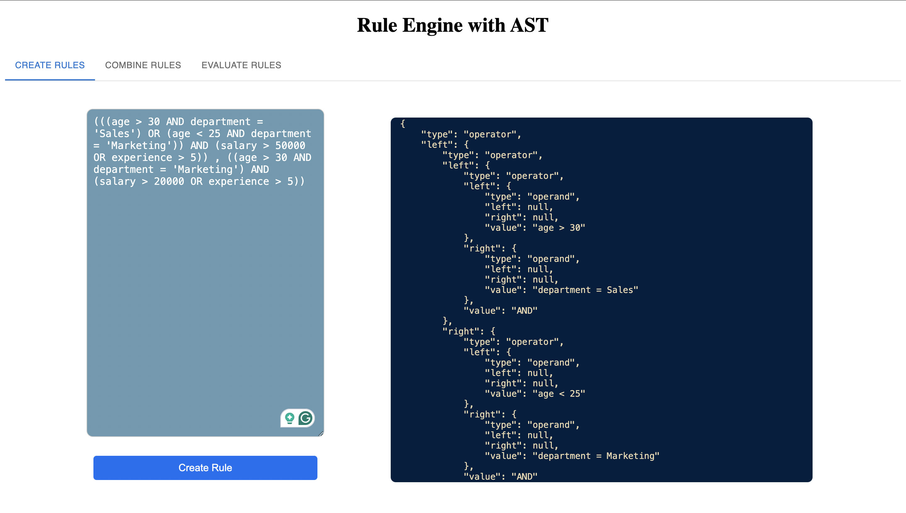
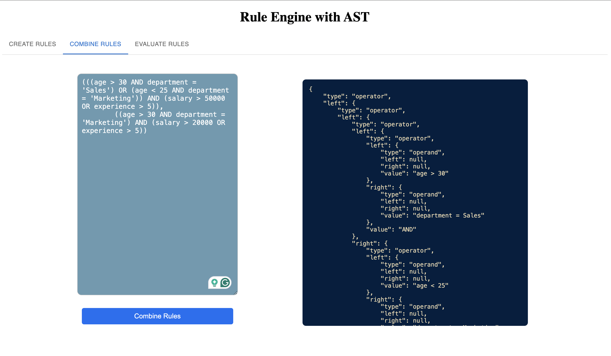
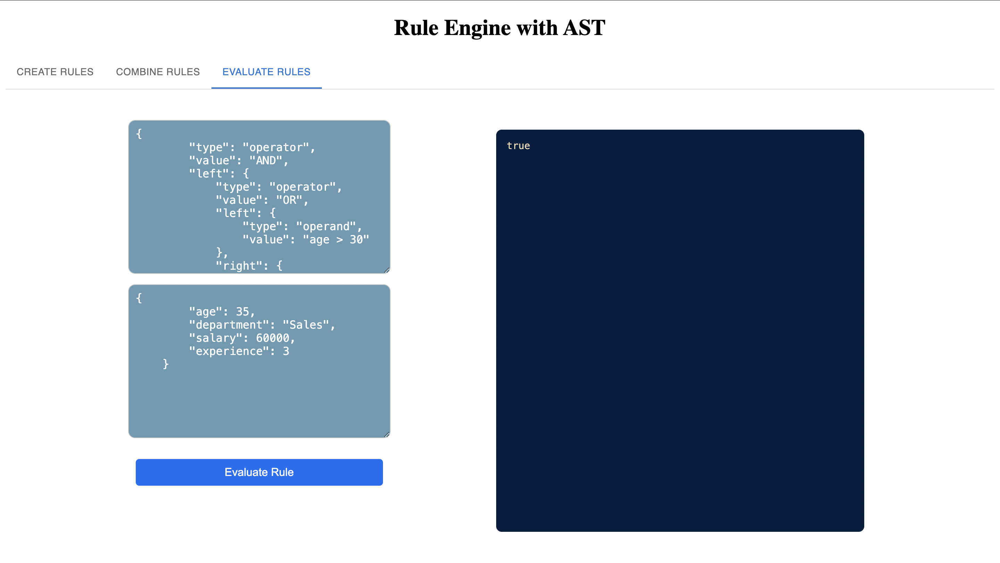

# 3-Tier Rule Engine Application

## Overview
A simple 3-tier rule engine application designed to determine user eligibility based on attributes such as age, department, income, spend, etc. This system leverages Abstract Syntax Tree (AST) for flexible and dynamic rule creation, combination, and modification. The application comprises a user interface, API backend, and a data layer.
This rule engine application enables the dynamic evaluation of user eligibility rules based on multiple attributes. Using AST, the system represents conditional logic, allowing administrators to define and modify rules dynamically without needing code changes. It is structured with a Next.js frontend, Spring Boot backend, and MongoDB as the data layer.

## WebApp Snapshots





## Architecture

This is a 3-tier application comprising the following components:
1. **Frontend**: Built with Next.js for creating rules and displaying eligibility results.
2. **Backend**: Built with Spring Boot to handle rule evaluation logic, AST processing, and API endpoints.
3. **Database**: MongoDB to store user data, eligibility rules, and logs.

## Features

- Dynamic rule creation and management.
- Eligibility checks based on configurable rules.
- Supports rules with attributes like age, department, income, and spend.
- Rule evaluation with AST for efficient and flexible rule processing.
- Simple and interactive user interface for rule configuration.

## Tech Stack

- **Frontend**: [Next.js](https://nextjs.org/)
- **Backend**: [Spring Boot](https://spring.io/projects/spring-boot)
- **Database**: [MongoDB](https://www.mongodb.com/)


## Installation

### Prerequisites

1. **Docker** (or **Podman** as an alternative)
2. **Node.js** (v14+)
3. **Java** (JDK 11 or higher)
4. **Maven** (for building the Spring Boot backend)

### Clone the Repository

```bash
git clone https://github.com/ishikasinghac/Zeotap-RuleEngineWithAST.git
cd rule-engine-app
```

#### Step 2: Setting up environment

```
##### MongoDB Connection
```bash
MONGO_URI=mongodb://localhost:27017/ast
```
##### Server Ports
```bash
FRONTEND_PORT=3000
BACKEND_PORT=8080
```

#### Step 3: Install Dependencies
##### Frontend
```bash
cd ast-web-portal
npm install
```
##### Backend
```bash
cd ast-service
./mvnw clean install
```
#### Step 4: Run Application

##### Frontend
```bash
cd ast-web-portal
npm run dev
```

##### Backend
```bash
cd ast-service
./mvnw spring-boot: run
```

The application will now be accessible on:
-Frontend: http://localhost:3000
-Backend: http://localhost:8080

## Design Choices

##### Frontend (Next.js)
- React Components: Efficiently renders weather data and enables a modern, dynamic UI.
- Server-Side Rendering: Ensures fast data loading and improves SEO.
- API Routes: Simplifies communication between Next.js frontend and Spring Boot backend.
##### Backend (Spring Boot)
- REST API: Exposes endpoints for frontend to access weather data and aggregated summaries.
- Service Layer: Handles data retrieval, rollup calculations, and alerting logic.
- Persistence Layer: Stores processed weather data in MongoDB for data analytics.
##### Database (MongoDB)
- NoSQL Structure: Flexible schema for real-time weather data and daily aggregates.
- Rollups and Aggregates: Stores calculated daily summaries for fast retrieval.

## Dependencies
##### Frontend (Next.js)
material-ui: for enhanced UI components and tabs.
axios: For API requests to the backend.
dotenv: Manages environment variables.

##### Backend (Spring Boot)
Spring Boot Starter Web: Builds RESTful web services.
Spring Boot Starter Data MongoDB: Integrates MongoDB.
Project Lombok: Reduces boilerplate code for model classes.

##### Database
MongoDB: Stores real-time weather data and aggregates.
MongoDB Compass: Provides centralized MongoDB application for easy setup.
